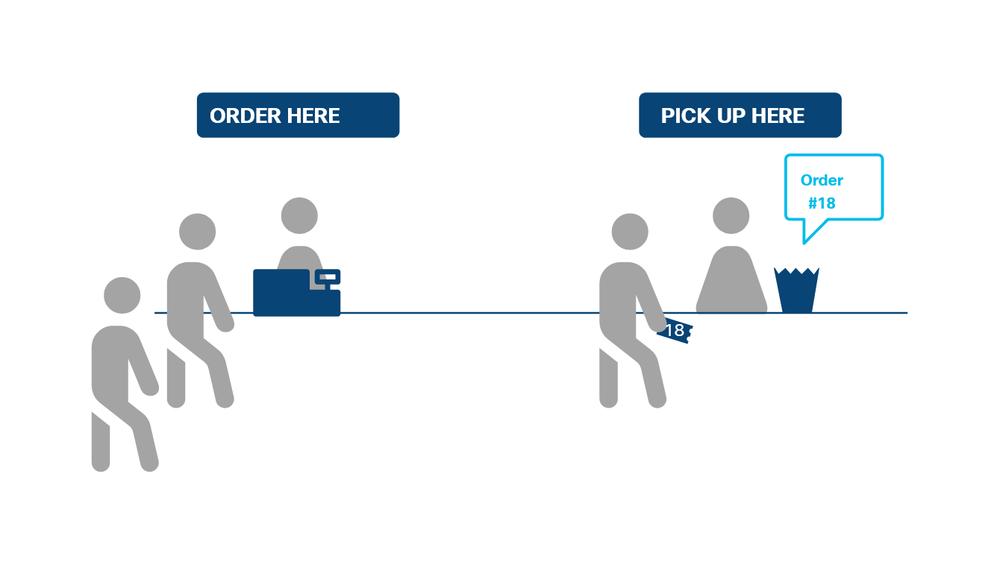

<!-- 4.2.1 -->
## Типы стилей проектирования

API-интерфейсы могут быть доставлены одним из двух способов: синхронно или асинхронно. Вам необходимо знать разницу между ними, потому что приложение, использующее API, по-разному управляет ответом в зависимости от дизайна API. Каждый дизайн имеет свое предназначение, но также имеет свой собственный набор сложностей на стороне клиента и/или сервера. Набор API-интерфейсов продукта может состоять как из синхронного, так и из асинхронного дизайна, при этом дизайн каждого API не зависит от других. Однако в соответствии с передовой практикой логика дизайна должна быть последовательной.

<!-- 4.2.2 -->
## Синхронные API

<!-- /courses/devnet/337c1050-b012-11ea-8a1b-c929643d7563/338278f0-b012-11ea-8a1b-c929643d7563/assets/97808b90-bcc3-11ea-af32-dfde9d560aae.svg -->
Билеты продаются в порядке очереди. Это синхронный процесс.

Синхронные API отвечают на запрос напрямую, обычно немедленно предоставляя данные (или другой соответствующий ответ).

### Когда API синхронны?

API-интерфейсы обычно разрабатываются так, чтобы быть синхронными, когда данные для запроса легко доступны, например, когда данные хранятся в базе данных или во внутренней памяти. Сервер может мгновенно получить эти данные и немедленно ответить.

### Преимущества синхронного проектирования API

Синхронные API позволяют приложению немедленно получать данные. Если API спроектирован правильно, приложение будет иметь лучшую производительность, потому что все происходит быстро. Однако, если он спроектирован неправильно, запрос API будет узким местом, потому что приложение должно ждать ответа.

### Обработка на стороне клиента

Приложение, отправляющее запрос API, должно дождаться ответа, прежде чем выполнять какие-либо дополнительные задачи выполнения кода.

<!-- 4.2.3 -->
## Асинхронные API

<!-- /courses/devnet/337c1050-b012-11ea-8a1b-c929643d7563/338278f0-b012-11ea-8a1b-c929643d7563/assets/97808b91-bcc3-11ea-af32-dfde9d560aae.svg -->
Асинхронные API предоставляют ответ, чтобы указать, что запрос был получен, но в этом ответе нет фактических данных. Сервер обрабатывает запрос, что может занять некоторое время, и отправляет уведомление (или запускает обратный вызов) с данными после того, как запрос был обработан. Затем клиент может действовать с этими возвращенными данными.

### Когда API-интерфейсы асинхронны?

API-интерфейсы обычно разрабатываются так, чтобы быть асинхронными, когда запрос представляет собой действие, которое требует некоторого времени для обработки сервером, или если данные недоступны. Например, если серверу необходимо сделать запрос к удаленной службе для получения данных, он не может гарантировать, что он получит данные немедленно для отправки обратно клиенту. То, что API является асинхронным, не обязательно означает, что клиент не получит данные немедленно. Это только означает, что немедленный ответ с данными не гарантируется.

### Преимущества асинхронного дизайна API

Асинхронные API позволяют приложению продолжать выполнение без блокировки на время, необходимое серверу для обработки запроса. В результате приложение может иметь лучшую производительность, поскольку оно может выполнять несколько задач и выполнять другие запросы. Однако ненужное или чрезмерное использование асинхронных вызовов может иметь противоположный эффект на производительность.

### Обработка на стороне клиента

При асинхронной обработке дизайн API на стороне сервера определяет, что вы хотите делать на стороне клиента. Иногда клиент может установить прослушиватель или механизм обратного вызова, чтобы получать эти уведомления и обрабатывать их при их получении. В зависимости от дизайна приложения вашему клиенту может также потребоваться очередь для хранения запросов для поддержания порядка обработки. Другие конструкции API требуют, чтобы у клиента был механизм опроса, чтобы узнать статус и ход выполнения данного запроса.
