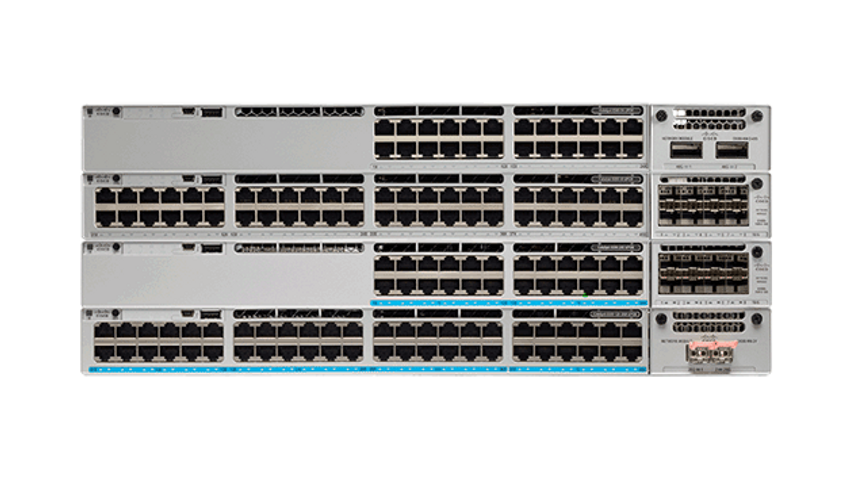
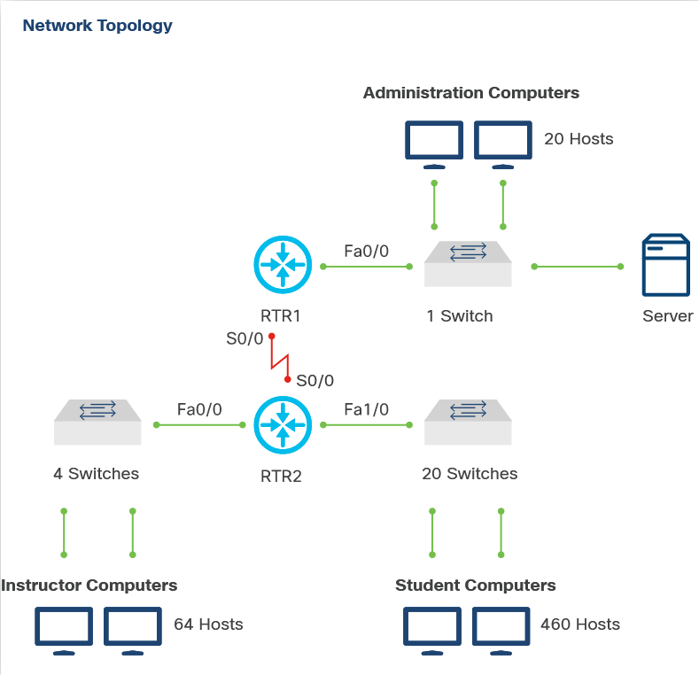

<!-- 5.4.1 -->
## Коммутаторы Ethernet

Ранее в этом модуле вы изучили функции коммутации и маршрутизации на сетевом уровне. В этом разделе вы более подробно изучите сетевые устройства, которые выполняют функции коммутации и маршрутизации.

Ключевым понятием коммутации Ethernet является широковещательный домен. Широковещательный домен - это логическое разделение, в котором все устройства в сети могут связываться друг с другом посредством широковещательной передачи на уровне канала данных. Широковещательные кадры должны пересылаться коммутатором на все его порты, кроме порта, который получил широковещательный фрейм. По умолчанию каждый порт на коммутаторе принадлежит одному широковещательному домену. Устройство уровня 3, такое как маршрутизатор, необходимо для завершения широковещательного домена уровня 2. Как обсуждалось ранее, VLAN соответствуют уникальному широковещательному домену.

В унаследованном совместно используемом Ethernet устройство, подключенное к порту концентратора, может передавать или получать данные в заданное время. Он не может передавать и получать данные одновременно. Это называется полудуплексной передачей. Полудуплексное общение похоже на общение с помощью раций, в которых одновременно может разговаривать только один человек. В полудуплексных средах, если два устройства передают одновременно, возникает коллизия. Область сети, в которой могут возникать коллизии, называется областью коллизий.

Одной из основных особенностей коммутаторов Ethernet по сравнению с устаревшими концентраторами Ethernet является то, что они обеспечивают полнодуплексную связь, что исключает домены коллизий. Коммутаторы Ethernet могут одновременно передавать и получать данные. Этот режим называется полнодуплексным. Полнодуплексное общение похоже на телефонное общение, при котором каждый человек может одновременно говорить и слышать то, что говорит другой человек.

Коммутаторы выполняют следующие функции:

* Работают на уровне доступа к сети модели TCP/IP и канальном уровне 2 уровня модели OSI.
* Фильтрация или лавинная рассылка кадров на основе записей в таблице MAC-адресов
* Имеют большое количество высокоскоростных и полнодуплексных портов

На рисунке показан пример коммутатора с несколькими высокоскоростными и полнодуплексными портами.

<!-- /courses/devnet/9c5edeb0-ba29-11ea-b646-8dfbdd4ba015/9d7cf8e0-ba29-11ea-b646-8dfbdd4ba015/assets/34d00c00-c083-11ea-8d86-7be8a5729d0c.png -->

Коммутатор динамически узнает, какие устройства и их MAC-адреса подключены к каким портам коммутатора. Он составляет таблицу MAC-адресов и фильтрует или загружает кадры на основе этой таблицы. Таблица MAC-адресов на коммутаторе похожа на приведенную ниже:

| **VLAN** | **MAC-адрес**  | **Тип**      | **Порты** |
| -------- | -------------- | ------------ | --------- |
| **1**    | 001b.10a0.2500 | Динамический | Gi0/1     |
| **1**    | 001b.10ae.7d00 | Динамический | Gi0/2     |
| **10**   | 0050.7966.6803 | Динамический | Gi0/3     |

Режим коммутации определяет, начинает ли коммутатор пересылку кадра, как только коммутатор считывает сведения о пункте назначения в заголовке пакета, или ожидает, пока весь кадр не будет получен и проверен на наличие ошибок, путем вычисления значения циклического контроля избыточности (CRC). , перед пересылкой по сети. Режим коммутации применим ко всем пакетам, коммутируемым или маршрутизируемым через оборудование, и может постоянно сохраняться посредством перезагрузки и перезапуска.

Коммутатор работает в одном из следующих режимов переключения:

* **Режим сквозной коммутации** - Коммутаторы, работающие в режиме сквозной коммутации, начинают пересылку кадра, как только коммутатор считывает сведения о пункте назначения в заголовке кадра. Переключатель в сквозном режиме пересылает данные до того, как он завершит прием всего кадра. Скорость переключения в режиме сквозного переключения выше, чем скорость переключения в режиме переключения с промежуточным хранением. Коммутация без фрагментов - это модифицированная форма сквозной коммутации, при которой коммутатор начинает пересылку кадра только после того, как прочитает поле Type. Коммутация без фрагментов обеспечивает лучшую проверку ошибок, чем сквозное переключение, практически без увеличения задержки.
* **Режим коммутации с промежуточным хранением** - Когда включена коммутация с промежуточным хранением, коммутатор проверяет каждый кадр на наличие ошибок перед его пересылкой. Каждый кадр сохраняется до тех пор, пока не будет получен и проверен весь кадр. Поскольку он ожидает пересылки кадра, пока весь кадр не будет принят и проверен, скорость переключения в режиме переключения с промежуточным хранением ниже, чем скорость переключения в режиме сквозного переключения.

Вот некоторые характеристики коммутаторов LAN:

* **Высокая плотность портов** - Коммутаторы имеют большое количество портов: от 24 до 48 портов на коммутатор в небольших устройствах до сотен портов на шасси коммутатора в более крупных модульных коммутаторах. Порты коммутатора обычно работают со скоростью 100 Мбит/с, 1 Гбит/с и 10 Гбит/с.
* **Большие буферы кадров** - Коммутаторы имеют возможность хранить полученные кадры, когда могут быть перегруженные порты на серверах или других устройствах в сети.
* **Быстрое внутреннее переключение** - Коммутаторы имеют очень быстрое внутреннее переключение. Они могут чрезвычайно быстро переключать пользовательский трафик с входного порта на выходной порт. Для подключения портов используются разные методы, которые влияют на общую производительность коммутатора, включая быструю внутреннюю шину, общую память или интегрированную матрицу коммутации.

<!-- 5.4.2 -->
## Маршрутизаторы

В то время как коммутаторы используются для подключения устройств к локальной сети и обмена кадрами данных, маршрутизаторы необходимы для связи с устройствами, находящимися не в одной локальной сети. Маршрутизаторы используют таблицы маршрутизации для маршрутизации трафика между разными сетями. Маршрутизаторы подключаются к разным сетям (или подсетям) через их интерфейсы и имеют возможность маршрутизировать трафик данных между ними.

Маршрутизаторы выполняют следующие функции:

* Они работают на интернет-уровне модели TCP/IP и сетевом уровне 3-го уровня модели OSI.
* Они маршрутизируют пакеты между сетями на основе записей в таблице маршрутизации.
* Они поддерживают большое количество сетевых портов, включая различные медиа-порты LAN и WAN, которые могут быть медными или оптоволоконными. Количество интерфейсов на маршрутизаторах обычно намного меньше, чем в коммутаторах, но количество поддерживаемых интерфейсов больше. IP-адреса настроены на интерфейсах.

На рисунке показан модульный маршрутизатор со встроенными портами коммутатора.

<!-- /courses/devnet/9c5edeb0-ba29-11ea-b646-8dfbdd4ba015/9d7cf8e0-ba29-11ea-b646-8dfbdd4ba015/assets/34d03310-c083-11ea-8d86-7be8a5729d0c.png -->

Напомним, что функциями маршрутизатора являются определение пути и пересылка пакетов. Маршрутизаторы поддерживают три механизма пересылки пакетов:

* **Процесс коммутации** - Когда пакет прибывает на интерфейс, он пересылается в плоскость управления, где ЦП сопоставляет адрес назначения с записью в своей таблице маршрутизации, а затем определяет выходной интерфейс и пересылает пакет. Маршрутизатор делает это для каждого пакета, даже если пункт назначения один и тот же для потока пакетов. Этот механизм переключения процессов очень медленный и редко реализуется в современных сетях. Сравните это с быстрым переключением.
* **Быстрое переключение** - При быстрой коммутации используется кэш быстрой коммутации для хранения информации о следующем переходе. Когда пакет поступает на интерфейс, он пересылается на уровень управления, где ЦП ищет совпадение в кэше быстрой коммутации. Если его нет, он переключается на процесс и перенаправляется на интерфейс выхода. Информация о потоке для пакета также сохраняется в кэше быстрой коммутации. Если другой пакет, идущий к тому же месту назначения, прибывает на интерфейс, информация о следующем переходе в кэше повторно используется без вмешательства процессора.
* **Cisco Express Forwarding (CEF)** - CEF - это самый последний механизм пересылки пакетов Cisco IOS по умолчанию. Как и быстрое переключение, CEF создает базу информации пересылки (FIB) и таблицу смежности. Однако записи в таблице не инициируются пакетом, как быстрое переключение, а инициируются изменениями, например, когда что-то изменяется в топологии сети. Следовательно, когда сеть объединилась, таблицы FIB и смежности содержат всю информацию, которую маршрутизатор должен учитывать при пересылке пакета. Cisco Express Forwarding - это самый быстрый механизм пересылки, который используется по умолчанию на маршрутизаторах Cisco и многоуровневых коммутаторах.

Общая аналогия, используемая для описания этих трех различных механизмов пересылки пакетов, следующая:

* Процесс коммутации решает проблему за счет длинных вычислений, даже если это та же проблема, которая была только что решена.
* Быстрая коммутация решает проблему, выполняя математические вычисления один раз и запоминая ответ для последующих идентичных задач.
* CEF заранее решает все возможные проблемы в электронной таблице.

<!-- 5.4.3 -->
## Межсетевые экраны

Брандмауэр - это аппаратная или программная система, предотвращающая несанкционированный доступ в сеть или из нее. Обычно брандмауэры используются для предотвращения доступа неавторизованных пользователей Интернета во внутренние сети. Следовательно, все данные, покидающие или входящие в защищенную внутреннюю сеть, должны пройти через брандмауэр, чтобы достичь места назначения, а любые неавторизованные данные блокируются. Роль межсетевого экрана в любой сети очень важна. Дополнительные сведения о том, как межсетевые экраны взаимодействуют с приложениями, представлены в модуле курса «Разработка приложений и безопасность».

На рисунке показан пример аппаратного межсетевого экрана.

<!-- https://contenthub.netacad.com/courses/devnet/9c5edeb0-ba29-11ea-b646-8dfbdd4ba015/9d7cf8e0-ba29-11ea-b646-8dfbdd4ba015/assets/34d03311-c083-11ea-8d86-7be8a5729d0c.jpg -->

Фильтрация пакетов без сохранения состояния

Самый простой (и оригинальный) тип межсетевого экрана - это межсетевой экран с фильтрацией пакетов без сохранения состояния. Вы создаете статические правила, разрешающие или запрещающие пакеты на основе информации заголовка пакета. Межсетевой экран проверяет пакеты, когда они проходят через межсетевой экран, сравнивает их со статическими правилами и соответственно разрешает или запрещает трафик. Эта фильтрация пакетов без сохранения состояния может быть основана на нескольких полях заголовка пакета, включая следующие:

* Исходный и/или целевой IP-адрес
* ID протокола IP
* Номер порта источника и/или назначения TCP или UDP
* Тип сообщения ICMP
* Флаги фрагментации
* Настройки опций IP

Этот тип межсетевого экрана лучше всего подходит для приложений TCP, которые каждый раз используют одни и те же статические порты, или для фильтрации, основанной исключительно на информации уровня 3, такой как IP-адрес источника или назначения.

Статические правила довольно просты, но они не работают для приложений, которые динамически используют разные наборы номеров портов TCP и/или UDP. Это связано с тем, что они не могут отслеживать состояние сеансов TCP или UDP при переходе от начального запроса к его выполнению, а затем к закрытию сеанса. Кроме того, эти статические правила построены с использованием ограничительного подхода. Другими словами, вы пишете явные правила, разрешающие определенный трафик, который считается приемлемым, и запрещающий все остальное.

Статические правила прозрачны для конечных систем, которые не знают, что они обмениваются данными с адресатом через высокопроизводительный межсетевой экран. Однако реализация статических правил требует глубокого понимания заголовков пакетов и процессов приложения.

### Фильтрация пакетов с отслеживанием состояния

Брандмауэр с фильтрацией пакетов с отслеживанием состояния выполняет ту же проверку заголовков, что и брандмауэр с фильтрацией пакетов без сохранения состояния, но также отслеживает состояние соединения. Это критическая разница. Чтобы отслеживать состояние, эти межсетевые экраны поддерживают таблицу состояний.

Типичная простая конфигурация работает следующим образом. Любые сеансы или трафик, инициированные устройствами в доверенных внутренних сетях, разрешаются через брандмауэр. Сюда входит запрос TCP-соединения для порта назначения 80. Брандмауэр отслеживает этот исходящий запрос в своей таблице состояний. Межсетевой экран понимает, что это начальный запрос, и поэтому соответствующий ответ от сервера разрешается обратно через межсетевой экран. Межсетевой экран отслеживает конкретный используемый порт источника и другую ключевую информацию об этом запросе. Сюда входят различные флаги IP и TCP и другие поля заголовков. Это добавляет некоторый интеллект брандмауэру.

Это позволит получать только действительные ответные пакеты, приходящие от определенного сервера. В ответных пакетах должны быть установлены все соответствующие IP-адреса источника и получателя, порты и флаги. Брандмауэр с фильтрацией пакетов с отслеживанием состояния понимает стандартный поток пакетов TCP/IP, включая скоординированное изменение информации между внутренними и внешними узлами, которое происходит в течение срока действия соединения. Межсетевой экран позволяет ненадежным внешним серверам отвечать на запросы внутренних узлов, но не позволяет ненадежным серверам инициировать запросы.

Конечно, вы можете создавать исключения из этой базовой политики. Ваша компания может счесть некоторые приложения неприемлемыми в рабочее время. Вы можете запретить внутренним пользователям устанавливать соединения с этими приложениями. Однако при традиционной фильтрации пакетов с отслеживанием состояния эта возможность ограничена. Эти традиционные межсетевые экраны не полностью поддерживают приложения.

Кроме того, у вас может быть веб-сервер, размещенный на территории корпорации. Конечно, вы хотите, чтобы все в мире имели доступ к вашему веб-серверу и покупали ваши продукты или услуги. Вы можете написать правила, которые позволяют любому пользователю в ненадежном Интернете создавать соответствующие входящие подключения к веб-серверу.

Эти межсетевые экраны с отслеживанием состояния лучше справляются с безопасностью на уровне 3 и 4, чем устройства без отслеживания состояния. Однако, как и фильтры пакетов без сохранения состояния, они практически не понимают, что происходит на уровнях 5–7 модели OSI; они «слепы» к этим слоям.

### Фильтрация пакетов на уровне приложений

Самый продвинутый тип межсетевого экрана - это межсетевой экран прикладного уровня, который может выполнять глубокую проверку пакета вплоть до уровня 7. Это дает вам более надежный и эффективный контроль доступа для уровней 3–7 OSI с более простой конфигурацией.

Эта дополнительная возможность проверки может повлиять на производительность. Ограниченное пространство буферизации может затруднить глубокий анализ контента.

Брандмауэр прикладного уровня может определять сеанс протокола передачи файлов (FTP) точно так же, как брандмауэр без отслеживания состояния или без отслеживания состояния. Однако этот брандмауэр может заглянуть глубже, на уровень приложения, чтобы увидеть, что это, в частности, операция «положить» FTP для загрузки файла. У вас могут быть правила, запрещающие любую загрузку по FTP. Или вы можете настроить более детализированное правило, такое как правило, которое запрещает все закачки по FTP, кроме тех, которые поступают с определенного IP-адреса источника, и только если имя файла - «os.bin».

Возможность более глубокой проверки пакетов брандмауэра прикладного уровня позволяет ему проверять соблюдение стандартных функций протокола HTTP. Он может отклонять запросы, которые не соответствуют этим стандартам или иным образом соответствуют критериям, установленным группой безопасности.

<!-- 5.4.4 -->
## Балансировщики нагрузки

Балансировка нагрузки улучшает распределение рабочих нагрузок между несколькими вычислительными ресурсами, такими как серверы, кластер серверов, сетевые каналы и т. Д. Балансировка нагрузки сервера помогает обеспечить доступность, масштабируемость и безопасность приложений и служб, распределяя работу одного сервера по нескольким серверам.

Балансировщик нагрузки решает, какой сервер должен получить запрос клиента, например веб-страницу или файл. Балансировщик нагрузки выбирает сервер, который может успешно выполнить клиентский запрос наиболее эффективно, не перегружая выбранный сервер или всю сеть.

На уровне устройства балансировщик нагрузки предоставляет следующие функции для поддержки высокой доступности сети:

* **Резервирование устройства** - Избыточность позволяет вам настроить одноранговое устройство балансировки нагрузки в конфигурации, чтобы, если один балансировщик нагрузки выходит из строя, другой балансировщик нагрузки может немедленно занять его место.
* **Масштабируемость** - Виртуализация позволяет запускать балансировщики нагрузки как независимые виртуальные устройства, каждое со своим распределением ресурсов.
* **Безопасность** - Списки контроля доступа ограничивают доступ от определенных клиентов или к определенным сетевым ресурсам.

На уровне сетевого обслуживания балансировщик нагрузки предоставляет следующие расширенные услуги:

* **Высокая доступность сервисов** - Высокопроизводительная балансировка нагрузки серверов позволяет распределять клиентские запросы между физическими серверами и фермами серверов. Кроме того, мониторинг работоспособности осуществляется на уровне серверов и серверной фермы посредством явных и неявных проверок работоспособности.
* **Масштабируемость** - Виртуализация позволяет использовать передовые алгоритмы балансировки нагрузки (предикторы) для распределения клиентских запросов между виртуальными устройствами, настроенными в балансировщике нагрузки. Каждое виртуальное устройство включает в себя несколько виртуальных серверов. Каждый сервер пересылает клиентские запросы на одну из ферм серверов. Каждая ферма серверов может содержать несколько физических серверов.
* **Безопасность на уровне служб** - Это позволяет устанавливать и поддерживать сеанс Secure Sockets Layer (SSL) между балансировщиком нагрузки и его одноранговым узлом, что обеспечивает безопасные транзакции данных между клиентами и серверами.

Хотя балансировщик нагрузки может распределять клиентские запросы между сотнями или даже тысячами физических серверов, он также может поддерживать постоянство сервера. В некоторых приложениях электронной коммерции все клиентские запросы в рамках сеанса направляются на один и тот же физический сервер, поэтому все товары в одной корзине для покупок хранятся на одном сервере.

Вы можете настроить виртуальный сервер для перехвата веб-трафика на веб-сайт и позволить нескольким реальным серверам (физическим серверам) отображаться как один сервер в целях балансировки нагрузки.

Виртуальный сервер привязан к физическим аппаратным и программным ресурсам, которые работают на реальном физическом сервере в ферме серверов. Их можно настроить для предоставления клиентских услуг или в качестве серверов резервного копирования.

Физические серверы, выполняющие одинаковые или похожие функции, группируются в фермы серверов. Серверы в одной и той же ферме серверов часто содержат идентичный контент (называемый зеркальным контентом), поэтому, если один сервер выходит из строя, другой сервер может немедленно взять на себя его функции. Зеркальное отображение контента также позволяет нескольким серверам распределять нагрузку в периоды повышенного спроса.

Вы можете распределять входящие клиентские запросы между серверами в ферме серверов, определяя правила балансировки нагрузки, называемые предикторами, с использованием информации об IP-адресе и порте.

Когда клиент запрашивает службу приложения, балансировщик нагрузки выполняет балансировку нагрузки сервера, решая, какой сервер может успешно выполнить клиентский запрос в кратчайшие сроки без перегрузки сервера или фермы серверов. Некоторые сложные предикторы учитывают такие факторы, как загрузка сервера, время отклика или доступность, что позволяет настраивать балансировку нагрузки в соответствии с поведением конкретного приложения.

Вы можете настроить балансировщик нагрузки так, чтобы один и тот же клиент мог поддерживать несколько одновременных или последующих TCP или IP-соединений с одним и тем же реальным сервером в течение сеанса. Сеанс определяется как серия взаимодействий между клиентом и сервером в течение некоторого конечного периода времени (от нескольких минут до нескольких часов). Эта функция постоянства сервера называется липкостью.

Многие сетевые приложения требуют, чтобы информация о клиенте постоянно сохранялась в нескольких запросах сервера. Типичный пример - корзина для покупок на сайте электронной коммерции. При использовании балансировки нагрузки на сервер может возникнуть проблема, если внутреннему серверу потребуется информация, сгенерированная на другом сервере во время предыдущего запроса.

В зависимости от того, как вы настроили балансировку нагрузки сервера, балансировщик нагрузки подключает клиента к соответствующему серверу после того, как он определит, какой метод балансировки нагрузки использовать. Если балансировщик нагрузки определяет, что клиент уже привязан к определенному серверу, то балансировщик нагрузки отправляет последующие клиентские запросы на этот сервер, независимо от критериев балансировки нагрузки. Если балансировщик нагрузки определяет, что клиент не привязан к определенному серверу, он применяет к запросу обычные правила балансировки нагрузки.

Комбинация предиктора и липкости позволяет приложению иметь масштабируемость, доступность и производительность, а также постоянство для обработки транзакций.

Конфигурация SSL в балансировщике нагрузки устанавливает и поддерживает SSL-сеанс между балансировщиком нагрузки и его одноранговым узлом, позволяя балансировщику нагрузки выполнять свои задачи по балансировке нагрузки для трафика SSL. Эти функции SSL включают аутентификацию сервера, генерацию закрытого и открытого ключей, управление сертификатами, а также шифрование и дешифрование пакетов данных. В зависимости от того, как настроен балансировщик нагрузки, он также может выполнять SSL-загрузку, прерывая сеанс SSL от клиента на самом балансировщике нагрузки. Таким образом, ресурсоемкие процессы SSL загружаются на сам балансировщик нагрузки, а не завершаются на внутренних серверах.

Службы приложений требуют мониторинга для обеспечения доступности и производительности. Балансировщики нагрузки можно настроить на отслеживание работоспособности и производительности серверов и серверных ферм путем создания зондов работоспособности. Каждая созданная проверка работоспособности может быть связана с несколькими реальными серверами или фермами серверов.

Когда мониторинг работоспособности балансировщика нагрузки включен, он периодически отправляет сообщения на сервер, чтобы определить его состояние. Балансировщик нагрузки проверяет ответ сервера, чтобы убедиться, что клиент может получить доступ к этому серверу. Подсистема балансировки нагрузки может использовать ответ сервера для включения или выключения сервера. Кроме того, подсистема балансировки нагрузки может использовать состояние серверов в ферме серверов для принятия надежных решений по балансировке нагрузки.

Дополнительные сведения о том, как балансировщики нагрузки взаимодействуют с приложениями и алгоритмами балансировки нагрузки, рассматриваются в модуле курса «Разработка приложений и безопасность».

<!-- 5.4.5 -->
## Сетевые диаграммы

Очень важно задокументировать свой код не только для того, чтобы облегчить его понимание и следовать другим людям, которые будут его читать и проверять, но и для вас самих. Через шесть месяцев, когда вы вернетесь и посмотрите на свой код, вы можете обнаружить, что очень сложно и отнимает много времени, чтобы вспомнить, что именно приходило вам в голову, когда вы писали эту удивительную функцию f () с подходящим названием.

Сетевые диаграммы являются частью документации, прилагаемой к развертыванию сети, и играют такую же важную роль, как и этапы документации в программном коде. Сетевые схемы обычно отображают визуальное и интуитивно понятное представление сети, показывая, как все устройства подключены, и в каких зданиях, этажах, туалете они расположены, а также какой интерфейс подключается к каждому устройству.

Представьте, что вас бросили в место, где вы никогда не были, без GPS, без карты и с инструкцией найти ближайший продуктовый магазин. Вот каково это - управлять сетью устройств без схемы сети и сетевой документации. Вместо того чтобы искать продуктовый магазин, вы должны выяснить, почему большое количество устройств больше не подключено к сети. Возможно, вам удастся найти продуктовый магазин, если вы пойдете в правильном направлении. Точно так же вы можете определить проблему с сетью. Но если бы у вас был доступ к карте, сетевой диаграмме, это заняло бы намного меньше времени.

По мере того, как сети строятся и конфигурируются и проходят весь свой жизненный цикл: заказ устройств, получение их на месте, подключение к сети и их настройка, обслуживание и мониторинг, их обновление, вплоть до вывода из эксплуатации и повторного запуска процесса, сетевые диаграммы необходимо обновлять и поддерживать, чтобы документировать все эти изменения.

Обычно есть два типа сетевых диаграмм:

* Диаграммы физического подключения уровня 2
* Схемы логической связи уровня 3

Уровень 2 или схемы физического подключения - это сетевые схемы, представляющие, как устройства физически подключены к сети. По сути, это визуальное представление того, какой сетевой порт на сетевом устройстве подключается к какому сетевому порту на другом сетевом устройстве. Такие протоколы, как Cisco Discovery Protocol (CDP) или Link Layer Discovery Protocol (LLDP), могут использоваться для отображения подключения физического сетевого порта между двумя или более устройствами. Эта сетевая диаграмма особенно полезна при устранении проблем с прямым сетевым подключением.

Уровень 3 или схемы логической связи - это сетевые схемы, которые отображают IP-соединение между устройствами в сети. Коммутаторы и устройства уровня 2 обычно даже не отображаются на этих схемах, поскольку они не выполняют никаких функций уровня 3, а с точки зрения маршрутизации они эквивалентны физическому проводу. Этот тип сетевой диаграммы полезен при устранении неполадок маршрутизации. Избыточные соединения и протоколы маршрутизации обычно присутствуют в сетях, требующих высокой доступности.

Пример упрощенной сетевой схемы уровня 2 показан на рисунке. Обратите внимание, что нет документированной информации уровня 3, такой как IP-адреса или протоколы маршрутизации.

<!-- /courses/devnet/9c5edeb0-ba29-11ea-b646-8dfbdd4ba015/9d7cf8e0-ba29-11ea-b646-8dfbdd4ba015/assets/acddd202-c04b-11ea-91bd-4b7461d9a91b.svg -->

Глядя на эту диаграмму, вы можете получить общее представление о том, как клиенты подключаются к сети и как сетевые устройства подключаются друг к другу, чтобы обеспечить сквозное соединение между всеми клиентами. Маршрутизатор RTR1 имеет в этой топологии два активных интерфейса: FastEthernet 0/0 и Serial 0/0. Маршрутизатор RTR2 имеет три активных интерфейса: FastEthernet0/0, FastEthernet 1/0 и Serial 0/0.

Большинство маршрутизаторов Cisco имеют сетевые слоты, поддерживающие модульные сетевые интерфейсы. Это означает, что маршрутизаторы являются надежным вложением в будущее в том смысле, что при увеличении пропускной способности сети, например, со 100 Мбит/с FastEthernet до 1 Гбит/с GigabitEthernet и далее до 10 Гбит/с TenGigabitEthernet, вы можете просто переключаться между модульными интерфейсами и по-прежнему использовать тот же роутер. Модульные карты Ethernet для маршрутизаторов Cisco обычно имеют несколько портов Ethernet на каждой карте.

Чтобы однозначно идентифицировать модульные карты и порты на каждой из этих карт, используется соглашение об именах. На приведенном выше рисунке FastEthernet 0/0 указывает, что эта модульная карта FastEthernet вставляется в первый сетевой модуль на маршрутизаторе (модуль 0, представленный первым 0 в 0/0) и является первым портом на этой карте (порт 0 , представленный вторым 0 в 0/0). Следуя этой логике, FastEthernet 0/1 ссылается на второй порт FastEthernet на первом модуле FastEthernet, а FastEthernet 1/2 на третий порт FastEthernet на втором модуле FastEthernet. Маршрутизаторы Cisco поддерживают большое количество сетевых модулей, реализующих различные технологии, включая следующие: FastEthernet (редко используется в наши дни), GigabitEthernet, 10GigabitEthernet, 100GigabitEthernet, последовательный порт точка-точка и другие.

Возвращаясь к приведенной выше сетевой схеме, мы видим, что на схеме есть 2 маршрутизатора RTR1 и RTR2, подключенных через последовательное сетевое соединение. Интерфейс FastEthernet 0/0 на RTR1 подключается к коммутатору, который обеспечивает сетевое подключение к серверу и 20 хостам в организации администрирования. Интерфейс FastEthernet 0/0 на маршрутизаторе RTR2 подключается к 4 коммутаторам, которые обеспечивают сетевое подключение к 64 хостам в группе инструкторов. Интерфейс FastEthernet 1/0 на маршрутизаторе RTR2 подключается к 20 коммутаторам, которые обеспечивают сетевое подключение к 460 хостам в группе Student.

<!-- 5.4.6 -->
## Packet Tracer - Исследование простой сети

Packet Tracer - отличный инструмент для построения и тестирования сетей и сетевого оборудования. Как разработчику важно, чтобы вы были знакомы с сетевыми устройствами и тем, как они взаимодействуют друг с другом. Простая сеть в этом упражнении Packet Tracer предварительно настроена, чтобы дать вам возможность исследовать устройства.

Вы выполните следующие задачи:

* Часть 1: Добавление ПК в топологию
* Часть 2: Проверка подключения в сети
* Часть 3. Создание и просмотр веб-страницы
* Часть 4: Изучите списки доступа межсетевого экрана

[Исследование простой сети (pdf)](../05.04.06-lab-explore-a-simple-network/asset/5.4.6-packet-tracer---explore-a-simple-network-ru.pdf)
[Исследование простой сети (pka)](../05.04.06-lab-explore-a-simple-network/asset/5.4.6-packet-tracer---explore-a-simple-network-ru.pka)
[Исследование простой сети (md)](../05.04.06-lab-explore-a-simple-network/README.md)