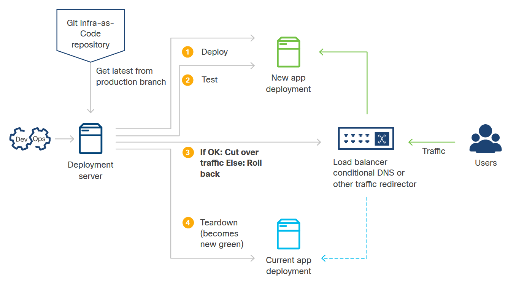

<!-- 7.5.1 -->
## Зачем хранить инфраструктуру в виде кода?

Здесь пора ввести новый термин: неизменность. Буквально это означает «состояние неизменности», но на языке DevOps это относится к обслуживанию систем полностью как коду, без выполнения каких-либо ручных операций над ними.

В этих темах несколько раз затрагивалась концепция рассмотрения инфраструктуры как кода. Но до сих пор он в основном занимался механикой. Вы знаете, что имеет смысл автоматизировать развертывание полных стеков, которые представляют собой виртуальные инфраструктуры (вычисления/хранилище/сеть) плюс приложения. Вы видели несколько подходов к написанию базового кода автоматизации и к механике инструментов автоматизации, а также к безопасному хранению кода и его извлечению из репозиториев управления версиями.

Теперь вы знакомы с идеей идемпотентности и связанными с ней темами и увидели, как можно было бы составить код автоматизации, который был бы очень безопасен для выполнения. Это код, который ничего не ломает, а вместо этого исправляет ситуацию и сходится к желаемому состоянию, описанному (частично или полностью) декларативной моделью развернутой системы. Вы также узнали, как подобный код можно использовать для ускорения операций, решения проблем методом грубой силы, а не детальной криминалистической экспертизы и подверженных ошибкам, трудоемких ручных операций.

### GitOps: современная инфраструктура как код

Приверженность неизменности позволяет вам обращаться с базой кода автоматизации, как с любым кодом приложения:

* Вы можете быть уверены, что кодовая база описывает, что на самом деле работает на голом железе или на облачных серверах.
* Вы можете управлять процедурами Agile кодовой базы и структурированным использованием контроля версий, чтобы все было ясно и просто.

Это «GitOps», также называемый «операциями по запросу на вытягивание». В типичной настройке GitOps вы можете поддерживать репозиторий, например частное репо на GitHub, с несколькими ветвями, называемыми «Разработка», «Тестирование/UAT» и «Производство».

### GitOps - это «Операции по запросу на слияние»

<!-- /courses/devnet/1035e850-b0bc-11ea-a04f-618a6d0a372e/1057c830-b0bc-11ea-a04f-618a6d0a372e/assets/ddc9031b-c0c5-11ea-a947-f5323e7496e3.svg -->

В этой модели каждое отделение развертывается в изолированной инфраструктуре.

* **Развитие** - Разработчики вносят изменения в ветку «Разработка», регистрируя коммиты и отправляя запросы на вытягивание. Эти запросы выполняются автоматическим процессом стробирования и помещаются в очередь для автоматического тестирования. Операторы видят результаты автоматизированного тестирования, а разработчики выполняют итерацию, пока тесты не пройдут. Затем изменения объединяются в ветвь Test для следующего уровня проверки.
* **Контрольная работа** - Когда изменения объединяются из «Разработка» в «Тестирование», код развертывается в более крупной тестовой среде и подвергается более обширному набору автоматических тестов.
* **Производство** - Протестированные изменения снова проверяются и объединяются в производственную среду, из которой выполняется развертывание выпуска.

К тому времени, как проверенный временем код зафиксирован, оценен, повторен и объединен с производственной веткой, он прошел как минимум два полных цикла тестирования на последовательно более производственной инфраструктуре, а также прошел осознанную оценку несколькими экспертами. В результате получается код, который в достаточной степени свободен от ошибок и хорошо работает. Эту операционную модель можно использовать для развития расширенных возможностей самообслуживания и самовосстановления вычислений/хранилищ/сети/PaaS или для реализации крупномасштабных распределенных приложений с расширенной оркестровкой контейнеров.

Куда вас может привести GitOps?

Когда ваши процедуры и рабочий процесс GitOps, стробирование/CI-CD, автоматическое тестирование и другие компоненты готовы, вы можете начать экспериментировать с элитными стратегиями развертывания, которые требуют безупречной автоматизации.

### Синие/зеленые развертывания

Сине-зеленое развертывание - это метод сокращения или устранения простоев в производственной среде. Это требует, чтобы вы поддерживали две идентичные производственные среды (вам не нужно называть их синим и зеленым. Подойдут любые два цвета, такие как красный и черный). Разработайте возможность быстрого перенаправления трафика приложений к тому или другому (с помощью автоматизации ACI, балансировки нагрузки, программируемого DNS или других средств).

Релиз развертывается в среде, которая в настоящее время не используется (зеленый). После приемочного тестирования перенаправьте трафик в эту среду. Если возникнут проблемы, вы можете переключить трафик обратно в исходную среду (синий). Если Зеленое развертывание признано адекватным, ресурсы, принадлежащие синему развертыванию, могут быть оставлены, а роли поменяны для следующего выпуска.

На рисунке показаны три горизонтальных ряда, помеченные как производство, тестирование и разработка. В начале производственной линии находится овал c1, который в самом конце имеет линию к пунктирному модулю C5 со словами над ним: обзор кода, слияние, текст. Обведенный номер 1 git pull находится прямо через тестовую строку и находится на линии, которая идет от C1 вниз к C2 на линии разработки и соединяется с овалами c3, c4 и c5 с обведенным номером 2 итерацией и тестом под ним. Линия идет от строки разработки до c5 на тестовой строке с обведенным значком 3 git request-pull в кружке. Выше c5 - обзор кода, слияние, тестирование и строка, которая идет до c5 на производственной линии, помеченная обведенным 4 git request-pull.

<!-- /courses/devnet/1035e850-b0bc-11ea-a04f-618a6d0a372e/1057c830-b0bc-11ea-a04f-618a6d0a372e/assets/ddc9031b-c0c5-11ea-a947-f5323e7496e3.svg -->
> **Примечание**: Некоторые практики DevOps различают стратегии синий/зеленый и красный/черный. Они говорят, что синим/зеленым цветом этот трафик постепенно перемещается из одной среды в другую, поэтому он попадает в обе системы в течение некоторого периода; в то время как в красном/черном цвете движение прекращается сразу. Некоторые продвинутые практики DevOps, такие как Netflix, практикуют версию красного/черного на уровне сервера, которую они называют «переходящим красным/черным». При переходе на красный/черный серверы в обеих средах постепенно обновляются, в конечном итоге заканчивая одной версией, отличной друг от друга, и ее также можно откатить индивидуально. Это означает, что три (а не две) версии приложения или стека работают в обеих средах в любой момент времени.

### Канареечное тестирование

Canary-тестирование похоже на развертывание «сине-зеленого», но несколько более деликатное. Миграция между старым и новым развертыванием выполняется индивидуально для каждого клиента (или даже для каждого пользователя), и миграции выполняются намеренно, чтобы снизить риск и улучшить качество обратной связи. Некоторые клиенты могут быть очень заинтересованы в получении доступа к новым функциям и будут благодарны за предоставленную возможность. Они с радостью предоставят отзывы о выпусках по эффективным каналам.
