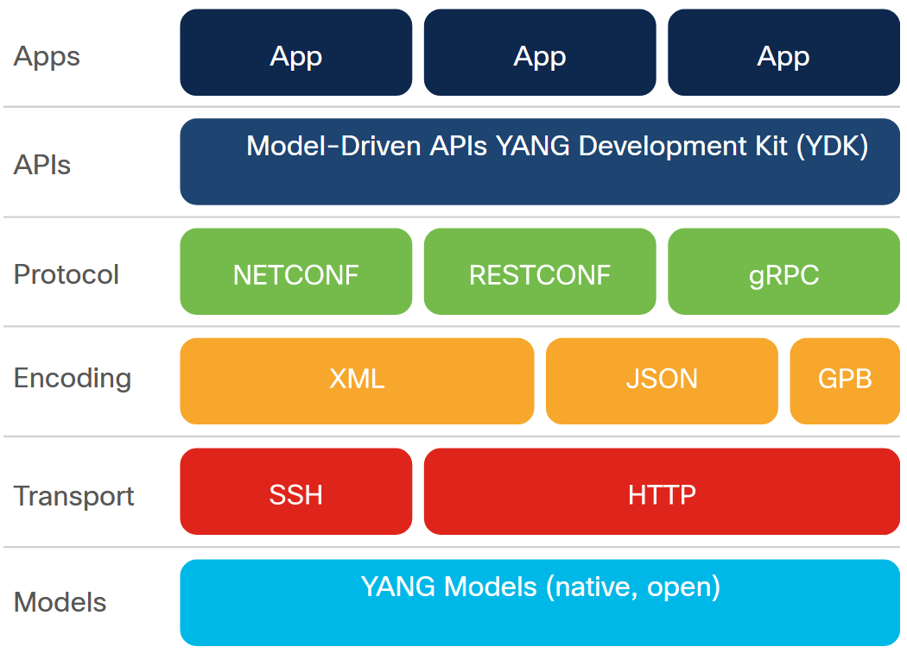
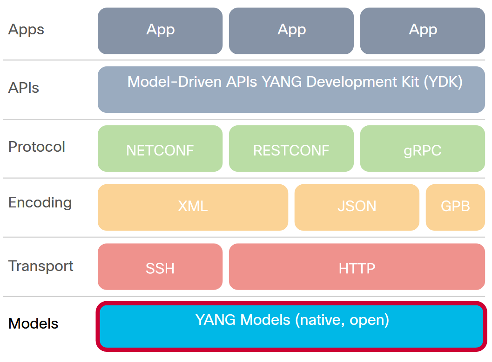
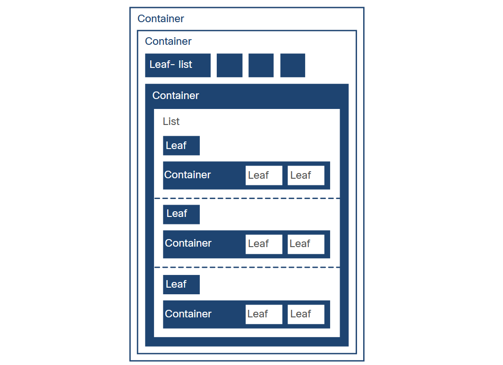
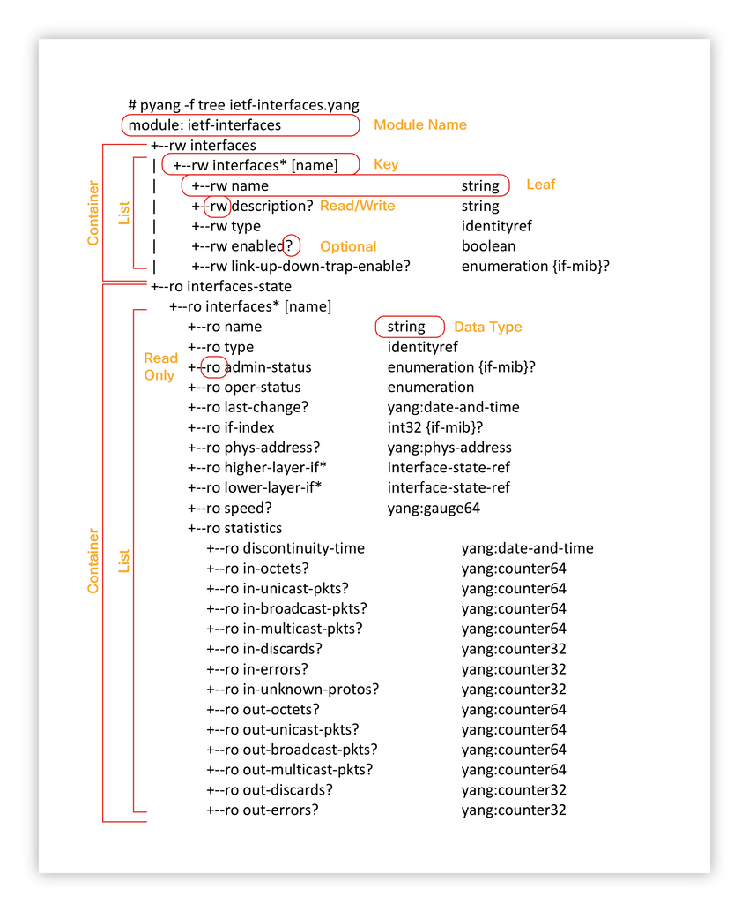
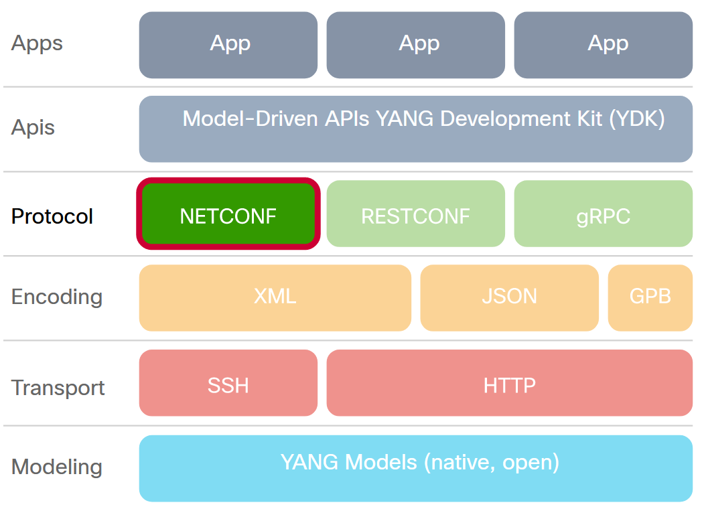
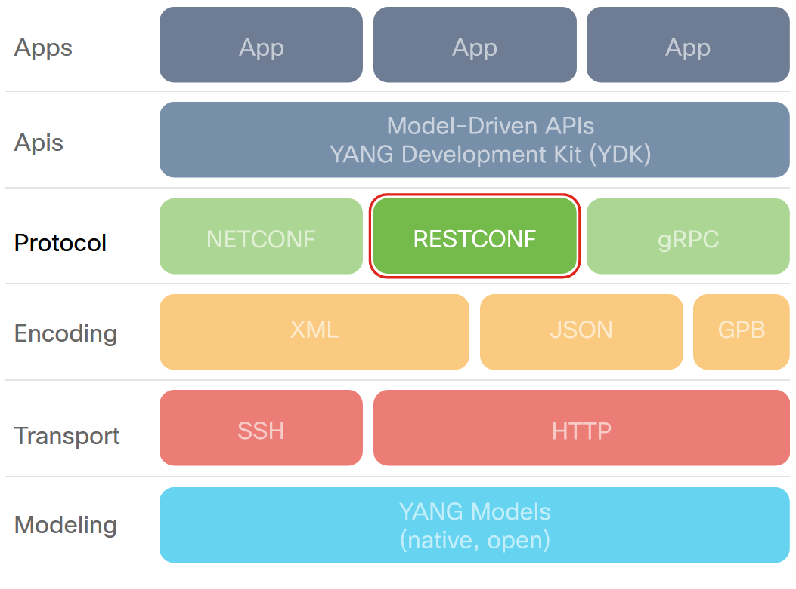

<!-- 8.3.1 -->
## Что такое модельно-ориентированное программирование?

Программируемость - это способность устройства принимать инструкции для управления или изменения поведения. Для сетевых устройств это часто означает настройку и управление с помощью программных протоколов. В отличие от ориентированных на человека интерфейсов, таких как CLI и GUI, программируемые интерфейсы явно предназначены для использования машинами.

Программируемость, управляемая моделями, наследует силу моделей, согласовывая возможности и услуги устройства со стандартизованными моделями. Это упрощает настройку сетевых устройств и устраняет недостатки, связанные с традиционными методами управления сетевыми устройствами.

### Что такое модель данных?

В общем, модель данных - это структурированный метод для описания любого объекта, будь то человек, машина, здание или какой-либо другой объект. Например, личные данные в паспорте или водительских правах могут описывать человека индивидуально, так что обе они являются «моделями данных».

В сети «модели данных» - это программный и основанный на стандартах способ записи конфигураций для любого сетевого устройства. Он может заменить ручную настройку, реализовав YANG в качестве фактического языка моделирования данных.

В современном сетевом мире один набор моделей данных основан на YANG и использует язык моделирования YANG. YANG версии 1 [RFC6020] или YANG версии 1.1 [RFC7950] используются для указания конфигурации и рабочего состояния, которое поддерживает устройство.

Стек модельно-ориентированного программирования на основе YANG выглядит так:


<!-- /courses/devnet/1e7f15f0-b0f6-11ea-983b-a3f6821d6983/1e83a9d0-b0f6-11ea-983b-a3f6821d6983/assets/9973e810-c09d-11ea-ae1e-a733eb29b8ad.svg -->

### Преимущества управляемой моделями программируемости

Традиционно для настройки сетевых устройств используются функции интерфейса командной строки или SDK. Интерфейсы командной строки и сценарии почти всегда зависят от устройства; их можно использовать только в устройствах одного типа, которые используют одни и те же интерфейсы командной строки одного поставщика. Более того, эти функции могут существовать не для всех команд конфигурации, а там, где они существуют, может быть сложно запрограммировать сложную конфигурацию.

Однако программирование на основе моделей предоставляет стандартный способ описания желаемой конфигурации сетевых устройств.

Конечно, само целевое устройство должно поддерживать конфигурацию на основе модели. Для моделей на основе YANG он должен поддерживать YANG и понимать протоколы более высокого уровня, основанные на YANG, такие как NETCONF и RESTCONF.

Конфигурации на основе модели по-прежнему должны быть доставлены на сетевое устройство. Доставка модели может быть инкапсулирована в API или обработана в оболочке SDK.

Таким образом, программируемость на основе модели:

* Предоставляет язык конфигурации, понятный человеку
* Основан на модели, структурирован и удобен для компьютера
* Включает поддержку нескольких типов моделей, включая собственные модели, OpenConfig и IETF.
* Использует спецификацию, которая отделена от транспорта, конечного кодирования протокола
* Использует API на основе моделей для абстракции и упрощения
* Использует открытый исходный код и пользуется широкой поддержкой

Чтобы понять программируемость, управляемую моделями, нам необходимо понять ее ключевые компоненты:

* YANG
* NETCONF
* RESTCONF

YANG - это язык моделирования. NETCONF и RESTCONF - это протоколы, используемые для программируемых интерфейсов модели данных.

<!-- 8.3.2 -->
## Что такое YANG?

YANG, аббревиатура от «Yet Another Next Generation (Еще одно следующее поколение)», как определено в RFC7519, - это «язык моделирования данных, используемый для моделирования конфигурации и данных состояния, управляемых протоколом конфигурации сети (NETCONF), удаленными вызовами процедур NETCONF и уведомлениями NETCONF».

### YANG в стеке управляемой моделью программирования


<!-- /courses/devnet/1e7f15f0-b0f6-11ea-983b-a3f6821d6983/1e83a9d0-b0f6-11ea-983b-a3f6821d6983/assets/99740f20-c09d-11ea-ae1e-a733eb29b8ad.svg -->

Модуль YANG определяет иерархии данных, которые могут использоваться для операций на основе NETCONF, включая конфигурацию, данные состояния, RPC и уведомления. Это позволяет получить полное описание всех данных, передаваемых между клиентом NETCONF и сервером. YANG также можно использовать с протоколами, отличными от NETCONF.

Хотя YANG может описывать любую модель данных, он изначально был разработан для сетевых моделей данных.

В реальном мире есть два типа моделей YANG: открытые и нативные.

* Модели Open YANG: разработаны поставщиками и органами по стандартизации, такими как IETF, ITU, OpenConfig и т. Д. Они разработаны, чтобы быть независимыми от базовой платформы и нормализовать конфигурацию сетевых устройств для каждого поставщика.
* Собственные модели: разработаны поставщиками, такими как Cisco. Они связаны и предназначены для интеграции функций или конфигурации, относящихся только к этой платформе.

### Зачем нам нужен YANG для моделирования устройств?

YANG предоставляет стандарт, но допускает дальнейшее описание. Нам нужен стандартный способ моделирования конфигурации сетевого устройства. YANG позволяет различным поставщикам сетевых устройств описывать их тип, конфигурацию и состояние устройства, чтобы сопоставить их работу устройства программным способом.

Термины, используемые в YANG, определены в разделе 3 RFC6020. Вот некоторые часто используемые термины, которые следует понять, прежде чем углубляться в YANG:

* **anyxml**: Узел данных, который может содержать неизвестный фрагмент XML-данных.
* **увеличение**: Добавляет новые узлы схемы к ранее определенному узлу схемы.
* **контейнер**: Внутренний узел данных, который существует максимум в одном экземпляре дерева данных. Контейнер не имеет значения, это скорее набор дочерних узлов.
* **модель данных**: Модель данных описывает, как данные представлены и доступны.
* **узел данных**: Узел в дереве схемы, который может быть создан в дереве данных. Один из контейнеров, листьев, листовых списков, списков и anyxml.
* **дерево данных**: Созданное дерево данных конфигурации и состояния устройства.
* **производный тип**: Тип, производный от встроенного типа (например, uint32) или другого производного типа.
* **группировка**: Многоразовый набор узлов схемы. Группировка может использоваться локально в модуле, в модулях, которые ее включают, и другими модулями, которые импортируют из нее. Оператор группировки не является оператором определения данных и, как таковой, не определяет никаких узлов в дереве схемы.
* **идентификатор**: Используется для обозначения различных видов предметов YANG по имени.
* **лист**: Узел данных, который существует не более чем в одном экземпляре в дереве данных. Лист имеет значение, но не имеет дочерних узлов.
* **листовой список**: Как листовой узел, но определяет набор однозначно идентифицируемых узлов, а не один узел. У каждого узла есть значение, но нет дочерних узлов.
* **список**: Внутренний узел данных, который может существовать в нескольких экземплярах в дереве данных. Список не имеет значения, это скорее набор дочерних узлов.
* **модуль**: Модуль YANG определяет иерархию узлов, которые могут использоваться для операций на основе NETCONF. Благодаря своим определениям и определениям, которые он импортирует или включает из других источников, модуль является самодостаточным и «компилируемым».
* **RPC**: Удаленный вызов процедуры, используемый в протоколе NETCONF.
* **данные о состоянии**: Дополнительные данные о системе, которые не являются данными конфигурации, например, информация о состоянии только для чтения и собранная статистика [RFC4741].

YANG определяет четыре типа узлов для моделирования данных. Подробности описаны в разделе 4.2.2 RFC6020 или в разделе 4.2.2 RFC 7950.

* Листовые узлы
* Узлы листового списка
* Узлы контейнера
* Список узлов

Модуль YANG содержит последовательность операторов. Каждый оператор начинается с ключевого слова, за которым следует ноль или один аргумент, за которым следует либо точка с запятой (`;`), либо блок вложенных операторов, заключенный в фигурные скобки `("{ }")`.

```
statement = keyword [argument] (";" / "{" *statement "}")
```

В модуле YANG есть четыре основных утверждения:

* **Контейнер**: Группа других утверждений (не имеет «Ценности»).
* **Список**: Несколько записей, содержащих хотя бы один листовой «ключ» и произвольную иерархию других операторов.
* **Лист**: Одна пара ключ/значение.
* **Лист-лист**: Несколько пар "ключ-значение" одного типа.

### Конструкции модуля YANG

Модули обычно имеют корень из одного или нескольких контейнеров, а дерево схемы распространяется на другой уровень структур данных. Ветка заканчивается листьями и/или листовыми листами.

### Структура модуля YANG


<!-- /courses/devnet/1e7f15f0-b0f6-11ea-983b-a3f6821d6983/1e83a9d0-b0f6-11ea-983b-a3f6821d6983/assets/99740f21-c09d-11ea-ae1e-a733eb29b8ad.svg-->

### YANG в действии

Теперь давайте посмотрим на пример файла YANG в реальной жизни, `ietf-interfaces.yang`. Этот открытый модуль YANG содержит набор определений YANG для управления сетевыми интерфейсами.

Когда вы знаете терминологию и структуру YANG, нетрудно понять содержание файла YANG, который имеет очень подробные комментарии и описания. Но эти описания также делают файл очень длинным. К счастью, есть инструменты для извлечения контента в более удобочитаемом и кратком виде, а инструмент `pyang` - один из них.

Вы можете установить `pyang` используя `pip` команда в виртуальной среде.

Как вы можете видеть ниже, используя `pyang` инструмент может преобразовать файл YANG в понятную древовидную структуру.

1.	Создайте файл с именем `ietf-interfaces.yang` используя текстовый редактор локально.
2.	Скопируйте пример файла YANG с GitHub. Например, вы можете перейти кhttps://github.com/YangModels/yang/blob/master/standard/ietf/RFC/ietf-interfaces%402018-02-20.yangдля открытой модели, илиhttps://github.com/YangModels/yang/blob/master/vendor/cisco/xr/602/ietf-interfaces.yangдля собственной модели производителя.
3.	Нажмите кнопку Raw и скопируйте текст со страницы в локальный `ietf-interfaces.yang` файл в текстовом редакторе.
4.	Спасти `ietf-interfaces.yang` файл локально, где вы установили `pyang`.
5.	В каталоге, в котором вы сохранили файл YANG, запустите `pyang -f дерево ietf-interfaces.yang` команда для создания древовидного списка ресурсов ietf-интерфейса.

### Пример вывода Pyang

```
module: ietf-interfaces
   +--rw interfaces
   |  +--rw interface* [name]
   |     +--rw name                        string
   |     +--rw description?                string
   |     +--rw type                        identityref
   |     +--rw enabled?                    boolean
   |     +--rw link-up-down-trap-enable?   enumeration {if-mib}?
   +--ro interfaces-state
      +--ro interface* [name]
         +--ro name               string
         +--ro type               identityref
         +--ro admin-status       enumeration {if-mib}?
         +--ro oper-status        enumeration
         +--ro last-change?       yang:date-and-time
         +--ro if-index           int32 {if-mib}?
         +--ro phys-address?      yang:phys-address
         +--ro higher-layer-if*   interface-state-ref
         +--ro lower-layer-if*    interface-state-ref
         +--ro speed?             yang:gauge64
         +--ro statistics
            +--ro discontinuity-time    yang:date-and-time
            +--ro in-octets?            yang:counter64
            +--ro in-unicast-pkts?      yang:counter64
            +--ro in-broadcast-pkts?    yang:counter64
            +--ro in-multicast-pkts?    yang:counter64
            +--ro in-discards?          yang:counter32
            +--ro in-errors?            yang:counter32
            +--ro in-unknown-protos?    yang:counter32
            +--ro out-octets?           yang:counter64
            +--ro out-unicast-pkts?     yang:counter64
            +--ro out-broadcast-pkts?   yang:counter64
            +--ro out-multicast-pkts?   yang:counter64
            +--ro out-discards?         yang:counter32
            +--ro out-errors?           yang:counter32
```


<!-- https://contenthub.netacad.com/courses/devnet/1e7f15f0-b0f6-11ea-983b-a3f6821d6983/1e83a9d0-b0f6-11ea-983b-a3f6821d6983/assets/99740f22-c09d-11ea-ae1e-a733eb29b8ad.png -->

Поскольку YANG впервые использовался с NETCONF, взгляните на NETCONF поближе и посмотрите, как они соотносятся.

<!-- 8.3.3 -->
## Что такое NETCONF?

Конфигурация сети (NETCONF) - это протокол, определенный IETF RFC7519. Он предназначен для установки, управления и удаления конфигурации сетевых устройств. Это основной протокол, который сегодня используется с моделями данных YANG. Его операции реализуются поверх удаленного вызова процедур (RPC), обмен которыми осуществляется через безопасный транспортный протокол, такой как SSH.

### NETCONF в стеке управляемой моделью программирования


<!-- /courses/devnet/1e7f15f0-b0f6-11ea-983b-a3f6821d6983/1e83a9d0-b0f6-11ea-983b-a3f6821d6983/assets/99740f23-c09d-11ea-ae1e-a733eb29b8ad.svg-->

Протокол NETCONF использует кодирование данных на основе XML как для данных конфигурации, так и для сообщений протокола.

Протокол NETCONF предоставляет небольшой набор операций для управления конфигурациями устройств и получения информации о состоянии устройства. Базовый протокол обеспечивает операции по извлечению, настройке, копированию и удалению хранилищ данных конфигурации.

### Операции протокола NETCONF

Протокол NETCONF предоставляет набор операций для управления конфигурациями устройств и получения информации о состоянии устройства. Базовый протокол включает в себя следующие операции протокола:

| Операция          | Описание                                                                                             |
| ----------------- | ---------------------------------------------------------------------------------------------------- |
| **get**           | получить информацию о текущей конфигурации и состоянии устройства.                                   |
| **get-config**    | получить всю или часть указанной конфигурации.                                                       |
| **edit-config**   | редактировать конфигурацию устройства.                                                               |
| **copy-config**   | создать или заменить все хранилище данных конфигурации другим хранилищем данных полной конфигурации. |
| **delete-config** | удалить конфигурацию в хранилище данных.                                                             |
| **lock**          | заблокировать всю систему хранилища данных конфигурации устройства.                                  |
| **unlock**        | снять блокировку конфигурации, ранее полученную с помощью операции **lock**.                         |
| **close-session** | запросить корректное завершение сеанса NETCONF.                                                      |
| **kill-session**  | принудительное завершение сеанса NETCONF.                                                            |

### NETCONF против SNMP

Протоколы NETCONF и SNMP определены для удаленной настройки устройств.

### Сравнение характеристик

SNMP:

* Использует модель pull при получении данных с устройства, которая плохо масштабируется для платформ с высокой плотностью размещения
* Не имеет процесса обнаружения для поиска базы управляющей информации (MIB), поддерживаемой устройством
* Не поддерживает концепцию транзакций
* Отсутствует резервное копирование и восстановление конфигурации элемента.
* Ограниченная отраслевая поддержка конфигурационных MIB

NETCONF был разработан, чтобы позволить:

* Несколько хранилищ данных конфигурации (кандидат, запуск, запуск)
* Транзакции на уровне устройства и в сети
* Тестирование и проверка конфигурации
* Различие между конфигурационными и рабочими данными
* Выборочный поиск данных с фильтрацией
* Потоковая передача и воспроизведение уведомлений о событиях
* Расширяемые вызовы удаленных процедур
* Встроенный обмен возможностями

NETCONF RFC имеет три различных хранилища данных, которые являются целью чтения и записи конфигурации:

* работает (обязательно)
* кандидат (необязательно)
* запуск (необязательно)

### NETCONF против возможностей SNMP

| Пример использования                                    | NETCONF | SNMP |
| ------------------------------------------------------- | ------- | ---- |
| **Получить коллекцию полей статуса**                    | да      | да   |
| **Установить набор полей конфигурации**                 | да      | да   |
| **Установите поля конфигурации в транзакции**           | да      | нет  |
| **Транзакции через несколько сетевых элементов**        | да      | нет  |
| **Отправлять уведомления о событиях**                   | да      | да   |
| **Безопасный протокол**                                 | да      | да   |
| **Тестовая конфигурация перед окончательной фиксацией** | да      | нет  |

> **Примечание**: Вы узнаете, как использовать NETCONF в лабораторных условиях. Используйте NETCONF для доступа к устройству IOS XE.

<!-- 8.3.4 -->
## Что такое RESTCONF?

RESTCONF RFC 8040 определяет протокол и механизм для REST-подобного доступа к информации о конфигурации и управлению. Подобно NETCONF, он использует модели хранилища данных и команды команд, определенные в протоколе конфигурации сети (NETCONF), инкапсулированные в сообщениях HTTP. Как и в случае с NETCONF, язык YANG используется для определения синтаксиса структуры команд, а также семантики конфигурации, состояния и событий хранилища данных конфигурации.

### RESTCONF в стеке управляемой моделью программирования


<!-- /courses/devnet/1e7f15f0-b0f6-11ea-983b-a3f6821d6983/1e83a9d0-b0f6-11ea-983b-a3f6821d6983/assets/99740f24-c09d-11ea-ae1e-a733eb29b8ad.svg -->

RESTCONF использует структурированные данные (XML или JSON) и YANG для предоставления REST-подобных API, позволяющих программный доступ к устройствам. Команды HTTP GET, POST, PUT, PATCH и DELETE направляются в API RESTCONF для доступа к ресурсам данных, представленным моделями данных YANG. Эти базовые операции редактирования позволяют клиенту RESTCONF просматривать и изменять текущую конфигурацию.

RESTCONF не предназначен для замены NETCONF, а скорее для предоставления HTTP-интерфейса, который следует принципам REST и совместим с моделью хранилища данных NETCONF. Сетевое устройство может обслуживать как NETCONF, так и RESTCONF одновременно, или может предоставлять только одно или другое.

### RESTCONF против NETCONF

В целом NETCONF более всеобъемлющий, гибкий и сложный, чем RESTCONF. RESTCONF легче изучить и использовать для инженеров, уже имеющих опыт работы с REST API. Ниже приведены различия между NETCONF и RESTCONF:

* NETCONF поддерживает текущие хранилища данных и хранилища данных кандидатов, в то время как RESTCONF поддерживает только запущенное хранилище данных, поскольку любые изменения хранилища данных кандидатов фиксируются немедленно.
* RESTCONF не поддерживает получение или снятие блокировки хранилища данных. Если у хранилища данных есть активная блокировка, операция редактирования RESTCONF завершится ошибкой.
* Редактирование RESTCONF - это транзакция, ограниченная одним вызовом RESTCONF.
* RESTCONF не поддерживает транзакции на нескольких устройствах.
* Валидация неявная в каждой операции редактирования RESTCONF, которая либо завершается успешно, либо не выполняется.

### Операции NETCONF и сопоставление методов RESTCONF

| **Описание**                           | **NETCONF**                                   | **RESTCONF** |
| -------------------------------------- | --------------------------------------------- | ------------ |
| **Создать ресурс данных**              | <edit-config>, </edit-config>                 | POST         |
| **Получать данные и метаданные**       | <get-config>, <get> , </get-config>           | GET          |
| **Создать или заменить ресурс данных** | <edit-config> (nc:operation="create/replace") | PUT          |
| **Удалить ресурс данных**              | <edit-config> (nc:operation="delete")         | DELETE       |

Доступ к каждому серверу RESTCONF устройства осуществляется через методы API. Где найти RESTCONF API? Ответ заключается в том, что API отдельных устройств публикуются редко. Вместо этого URL-адреса методов определяются динамически.

RESTCONF RFC 8040 утверждает, что синтаксис базового URI RESTCONF `/restconf/<resource-type>/<yang-module:resource>`. `<resource-type>` и `<yang-module:resource>` являются переменными, а значения получены с использованием конкретных файлов модели YANG.

Основной формат URL-адреса RESTCONF: `https://<hostURL>/restconf<resource><container><leaf><options>` где любая часть после `restconf` можно опустить.

Первоначальный запрос GET только с частью `restconf` должна возвращать ответ с ресурсами, доступными на этом сервере. Например, GET построен следующим образом:

```
GET /restconf HTTP/1.1
Host: example.com
Accept: application/yang-data+json
```

Вернул бы что-то похожее на:

```
HTTP/1.1 200 OK
Date: Thu, 26 Jan 2017 20:56:30 GMT
Server: example-server
Content-Type: application/yang-data+json
    {   
        "ietf-restconf:restconf" : {
            "data" : {},
            "operations" : {},
            "yang-library-version" : "2016-06-21"
        }
    }   
```

Этот ответ говорит нам, что `data`, а также `operations` - это типы ресурсов RESTCONF, поддерживаемые этим устройством.

> **Примечание**:Вы узнаете, как использовать RESTCONF в лабораторной работе, Используйте RESTCONF для доступа к устройству IOS XE.

<!-- 8.3.5 -->
## Лабораторная работа - Изучение моделей YANG

В этой лабораторной работе вы узнаете, как использовать инструмент pyang с открытым исходным кодом для преобразования моделей данных YANG из файлов с использованием языка YANG в гораздо более удобный для чтения формат. Используя преобразование вида «дерево», вы определите ключевые элементы модели YANG ietf-интерфейсов.

Вы выполните следующие задачи:

* Часть 1. Запуск виртуальных машин DEVASC и CSR1000v
* Часть 2: Изучите модель YANG на GitHub
* Часть 3: Изучение модели YANG с помощью pyang

[Изучение моделей YANG](../08.03.05-lab-explore-yang-models/README.md)

<!-- 8.3.6 -->
## Лабораторная работа - Использование NETCONF для доступа к устройству IOS XE

В этой лабораторной работе вы будете использовать клиент NETCONF, ncclient, который представляет собой модуль Python для написания сценариев на стороне клиента. Вы будете использовать ncclient для проверки настройки NETCONF, получения конфигурации устройства и изменения конфигурации устройства.

Вы выполните следующие задачи:

* Часть 1: Постройте сеть и проверьте подключение
* Часть 2: Использование сеанса NETCONF для сбора информации
* Часть 3: Используйте ncclient для подключения к NETCONF
* Часть 4: Использование ncclient для получения конфигурации
* Часть 5: Использование ncclient для настройки устройства
* Часть 6: Задача: изменить программу, используемую в этой лабораторной работе

[Использование NETCONF для доступа к устройству IOS XE](../08.03.06-lab-use-netconf-to-access-an-ios-xe-device/README.md)

<!-- 8.3.7 -->
## Лабораторная работа - Использование RESTCONF для доступа к устройству IOS XE

В первой половине этой лабораторной работы вы будете использовать программу Postman для создания и отправки запросов API к службе RESTCONF, работающей на R1. Во второй половине лабораторной работы вы создадите сценарии Python для выполнения тех же задач, что и ваша программа Postman.

Вы выполните следующие задачи:

* Часть 1: Постройте сеть и проверьте подключение
* Часть 2: Настройка устройства IOS XE для доступа RESTCONF
* Часть 3: Откройте и настройте Postman
* Часть 4. Использование почтальона для отправки запросов GET
* Часть 5. Использование почтальона для отправки запроса PUT
* Часть 6. Использование скрипта Python для отправки запросов GET
* Часть 7. Использование сценария Python для отправки запроса PUT

[Использование RESTCONF для доступа к устройству IOS XE](../08.03.07-lab-use-restconf-to-access-an-ios-xe-devices/README.md)